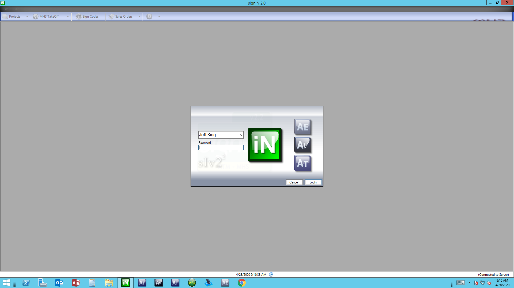
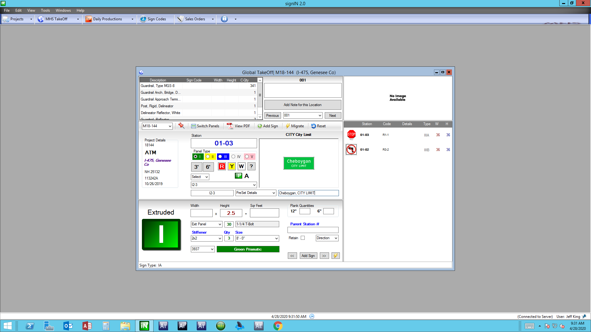

# SignIN VB.Net Application

A VB.Net Windows Forms Application for front-end and back-end logistics.

## Application Images
   
  

## Summary

This application began as a simple letter counting function, then blossomed into a complete front-end and back-end logistics database solution.  SignIN is as business-critical to the organization as QuickBooks, and the specialized CAD programs used.

Coming from a VBScript, JavaScript, ASP.Net, and SQLServer background; and beginning my interest in computer programming with BASIC, years ago, making the leap to VB.Net was relatively easy.  Creating a Windows Forms Application is not for the faint of heart, however.

This program serves the needs of its users at every step, from the "Take-Off" process, to fabrication, to keeping track of shipped products, to material certifications.  It communicates with four different databases on the company LAN, sharing data and providing reports and calculations to two different companies.  

Through the years of development, implementation, and use, the tasks handled by this program helped eliminate about 80% of the handwritten, manually tracked logistics.  We were able to reallocate human resources to areas of greater need.

Taking advantage of "Click-Once Deployment" technology, installation is as easy as sending a user a link to download the executable.  Each time the application opens, it will check online for any available updates, then prompt the user to download, updating automatically.

Writing every line of code, form and database design, case-use logistics, installation and deployment, was handled solely by me.  Although my preference would be to work on a team, it was quite the learning experience to build it independently.  Sometimes learning things the hard way, led to greater clarity, and better problem solving skills.

## Author

- **Jeff King** - _Full Stack Software Developer_ - [GitHub](https://github.com/jazfunk) | [LinkedIn](https://www.linkedin.com/in/jeffking222/) | [Website](https://jeff-king.net)
